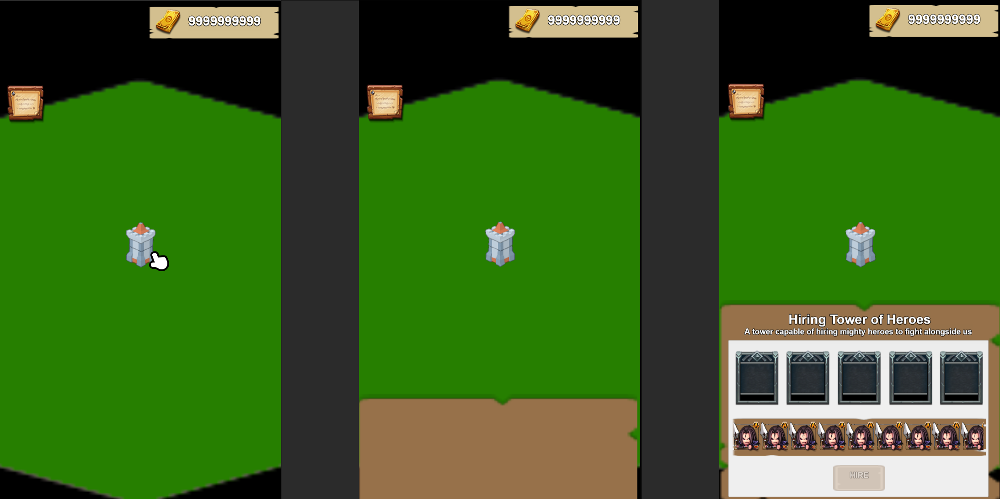
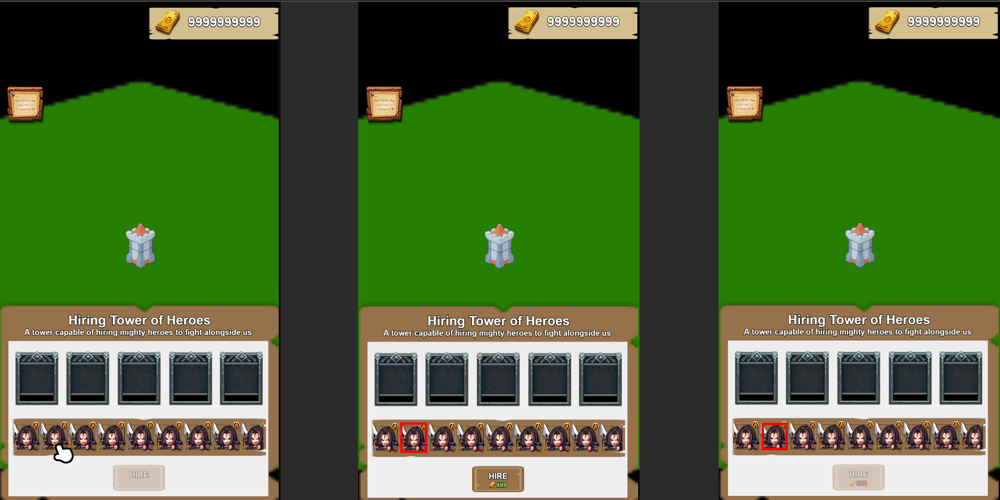
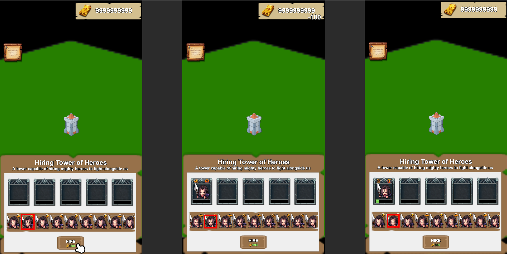
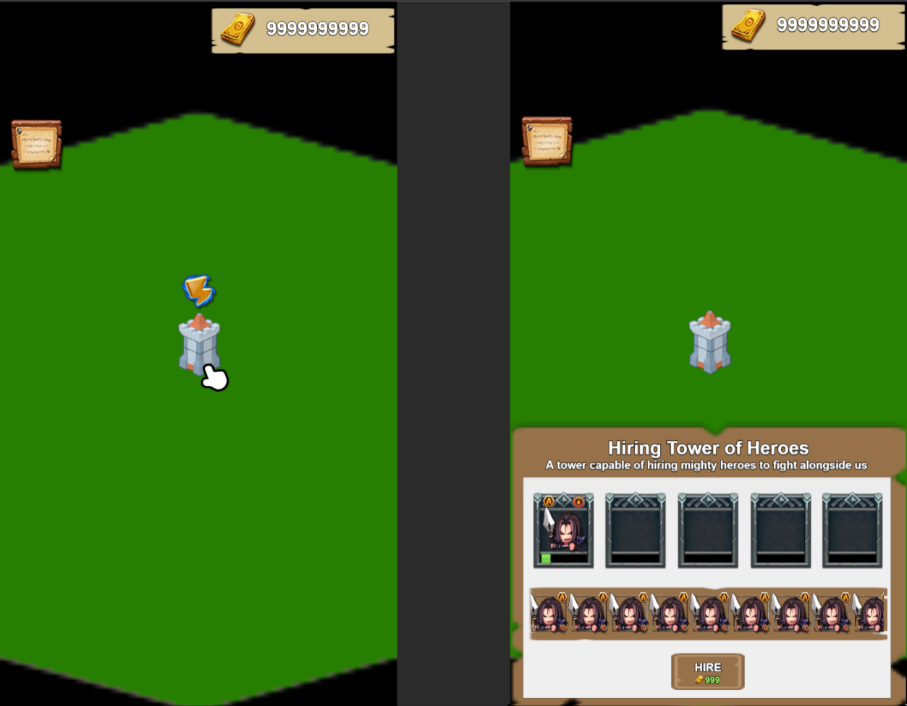
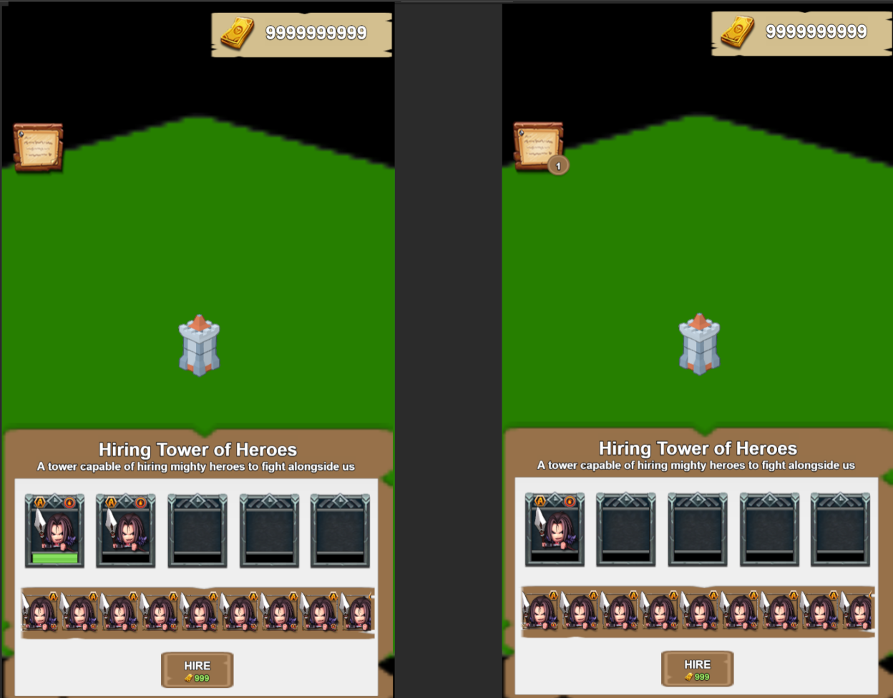
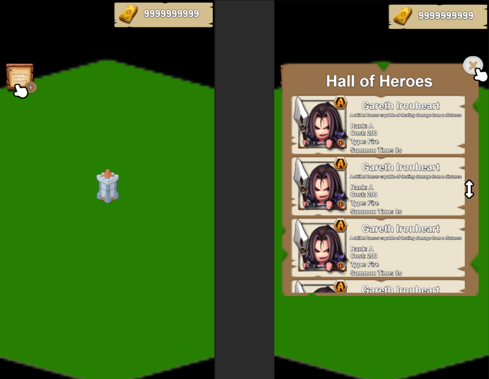

# Game Developer Test Task

Thank you for participating in this test!

In this exercise, we’ll walk through the specification, planning, and development of a feature using [Cocos Creator](https://www.cocos.com/en) and [TypeScript](https://www.typescriptlang.org/).

Main Goal: Plan and develop the proposed specification using [MVVM Architecture](https://en.wikipedia.org/wiki/Model%E2%80%93view%E2%80%93viewmodel) and [Reactive Programming](https://www.baeldung.com/cs/reactive-programming) patterns. While the provided UI/UX designs serve as a reference, feel free to explore your own ideas during development.

## Before we begin ...

- Install [Cocos Creator dashboard](https://www.cocos.com/en/creator-download).
    - If you’re new to Cocos Creator, explore the [documentation](https://docs.cocos.com/creator/3.8/manual/en/) and [API reference](https://docs.cocos.com/creator/3.8/api/en/).
    - If you’re transitioning from Unity, [compare the two engines](https://docs.cocos.com/creator/3.8/manual/en/guide/unity/).

- Install [Node.js](https://nodejs.org/en/download/package-manager).
    - If you are on MacOS, prefer to use [Homebrew](https://brew.sh/) for the [installation](https://formulae.brew.sh/formula/node).
    - Before opening the project, run `npm install` in the root directory.
    - [NPM](https://www.npmjs.com/about) is a library registry and a package manager.

- If you’re new to developing with TypeScript
    - Go through the [documentation](https://www.typescriptlang.org/docs/) reference.
    - Explore the language syntax using the [Playground](https://www.typescriptlang.org/play/?#code/PTAEHUFMBsGMHsC2lQBd5oBYoCoE8AHSAZVgCcBLA1UABWgEM8BzM+AVwDsATAGiwoBnUENANQAd0gAjQRVSQAUCEmYKsTKGYUAbpGF4OY0BoadYKdJMoL+gzAzIoz3UNEiPOofEVKVqAHSKymAAmkYI7NCuqGqcANag8ABmIjQUXrFOKBJMggBcISGgoAC0oACCbvCwDKgU8JkY7p7ehCTkVDQS2E6gnPCxGcwmZqDSTgzxxWWVoASMFmgYkAAeRJTInN3ymj4d-jSCeNsMq-wuoPaOltigAKoASgAywhK7SbGQZIIz5VWCFzSeCrZagNYbChbHaxUDcCjJZLfSDbExIAgUdxkUBIursJzCFJtXydajBBCcQQ0MwAUVWDEQC0gADVHBQGNJ3KAALygABEAAkYNAMOB4GRonzFBTBPB3AERcwABS0+mM9ysygc9wASmCKhwzQ8ZC8iHFzmB7BoXzcZmY7AYzEg-Fg0HUiQ58D0Ii8fLpDKZgj5SWxfPADlQAHJhAA5SASPlBFQAeS+ZHegmdWkgR1QjgUrmkeFATjNOmGWH0KAQiGhwkuNok4uiIgMHGxCyYrA4PCCJSAA).
    - Refer to [tutorials](https://www.totaltypescript.com/tutorials/beginners-typescript) to deepen your understanding.
    - The project includes [ESLint](https://typescript-eslint.io/) settings. If you’re using VSCode, consider installing the [ESLint extension](https://marketplace.visualstudio.com/items?itemName=dbaeumer.vscode-eslint) for language assistance.

- If you’re new to implementing Reactive patterns, start by understanding the [Reactive Programming principles](https://www.freecodecamp.org/news/reactive-programming-beginner-guide/)
    - This project uses [RxJs](https://rxjs.dev/) as the default Reactivity library.
    - Feel free to use other libraries or solutions if you prefer.

- As you work on the solution, consider making frequent commits rather than a single large one. 
    - We’re interested in seeing the steps you took to complete the assignment and understand your overall implementation plan.

- Once you have concluded this task, commit your solution to a repository and share the link with us.
    
### Data Settings and Assets

The necessary data settings can be found in the `./assets/settings/` folder. This directory contains the `.json` files to be used as the `data model` for the feature.

The art assets are located in the `./assets/sprites` folder and should provide sufficient support for developing the UI.

- Use this data set as a `starting point`. You’re also welcome to modify or expand this set as needed to create your solution.
- We’ve included a `series of placeholder assets` for use within the project. 
    - While you’re free to enhance or modify the existing assets to your liking, please avoid adding additional assets, especially if they are not Creative Commons licensed or related.
- We’ve included a `starting scene` in the project with a base configuration. You can either continue from there or build your own.

## To the task!

We will be developing the `Hiring Tower of Heroes` feature. 

Inside our base, there is a `special tower building` capable of hiring mighty `heroes` to fight alongside us. Each hero has their own `price` and `time to respond` for joining our forces.

The `player HUD` holds some relevant information like:
- The amount of `currency` available
- The town `signpost`
- The tower `UI` (once activated)

Players can view the available heroes for hire and their information by `clicking on the tower building`. The tower UI will `slide up from the bottom` and display the `building information`, the `hero list` and the `hero summon queue`. The UI container remains active until a click `outside of the container` is registered.

The tower `can queue up to 5 heroes` to be summoned, but it can only process `one hero at a time`.

Once the player selects one of the available heroes from the list, the clicked portrait `becomes highlighted`, activates the `hire button`, and updates the `price cost label` element. If the player has `enough currency` to do the summon as also `availability on the building queue`, the label has a `green color` and can be clicked. If not, label `turns red` and cannot be clicked.

After `clicking` the hire button, the cost is `deducted` from the player’s currency state, and a tween animation occurs at the `currency HUD element`. The hero is then `added` to the building queue for summoning. Once in the queue (and if first in line), the hero summon `updates a progress bar` based on the hero’s cooldown settings, considering the time in `seconds`.

If the tower is `summoning a hero` and the building `UI is not activated`, you must indicate that the summoning `is in progress with an icon` on top of the building.

All hero summons are recorded on the `town signpost` and can be checked at any time. The signpost `counter becomes active` once we have our first hero summoned. It keeps track of the `total number of heroes` summoned and available at the base.

When `clicked`, it opens a UI dialog that provides `detailed information` about all summoned heroes. To exit this dialog, the player must click on the `exit button`. If any HUD UI is already active, you must `first deactivate it` before opening this dialog.

